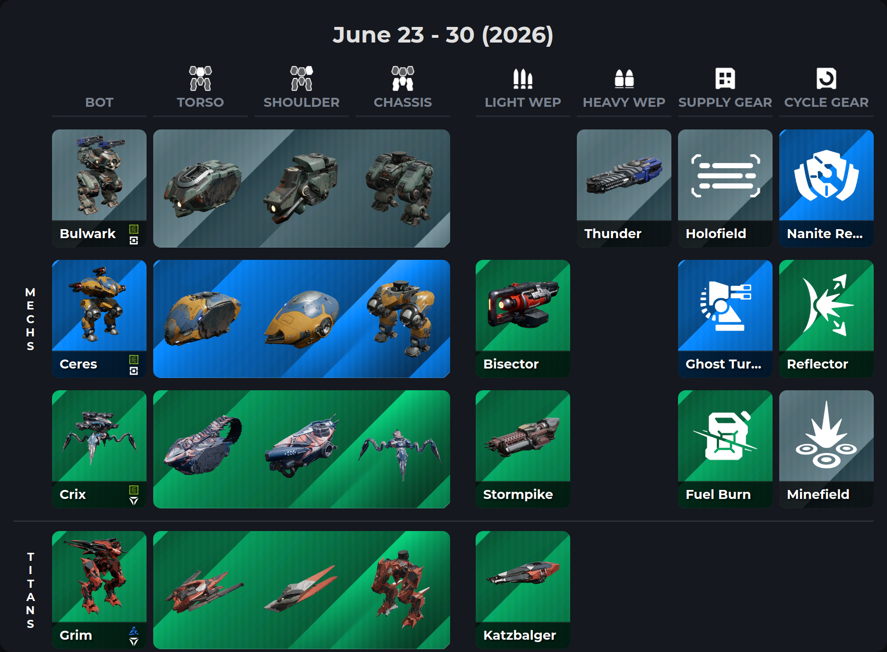

# WRFrontiers Discount Visualizer

Turns a weekly War Robots Frontiers discount item list into a static visual grid site. A Python backend maps in-game names to game data, generates layout JSON, and archives each week; an Astro frontend renders the grid with textures and deploys to GitHub Pages. A captured screenshot is embedded as `og:image` for Discord and other link previews.

**Live site:** [surxe.github.io/WRFrontiers-Discount-Visualizer](https://surxe.github.io/WRFrontiers-Discount-Visualizer/)



## Features

- Fuzzy item-name mapping with persistent overrides in `manual_mapping.json`
- Virtual Bot expansion to core modules (titan weapons filtered out)
- Responsive 7-column discount grid with game textures
- Archived discount history under `archive/discounts/`
- Timeline and items pages for browsing past weeks
- Automated Puppeteer screenshot capture for Discord-friendly embeds

## Weekly discount update workflow

This is the routine when a new in-game discount week is announced.

### 1. Gather inputs

- **Items** — plain comma-separated names as announced (e.g. `Phantom, Lighter, Blink`).
- **Date range** — start and end dates as `mm-dd mm-dd` (e.g. `06-16 06-23`).

### 2. Run the pipeline (production)

In GitHub, open **Actions → All → Run workflow** and fill in:

| Input | Description |
|-------|-------------|
| `items` | Comma-separated item names |
| `target_date_range` | Week range, e.g. `06-16 06-23` |
| `skip_deploy` | Leave unchecked to build and deploy; check to map only |

The **All** workflow (`.github/workflows/all.yml`) runs four stages:

1. **Map** — Backend steps 1–3:
   - Rebuilds `game_data.json` from the latest `WRFrontiersDB-Data`
   - Fuzzy-maps item names; new non-1:1 matches are saved to `manual_mapping.json`
   - Expands Virtual Bots to core modules
   - Writes `archive/discounts/discounts_<slug>.json`
   - Generates `src/frontend/public/data/week_grids/grid_<slug>.json`
   - Updates `weeks.json` and `discount_data.json`
   - Commits and pushes: `chore(data): update mapped discounts [skip ci]`

2. **Screenshot** — Checks out game data, builds the site, runs Puppeteer, uploads `discount-table.png` as an artifact.

3. **Build** — Downloads the PNG into `public/`, runs the final Astro build with the screenshot baked in for `og:image`.

4. **Publish** — Deploys the static bundle to GitHub Pages.

### 3. Fix mapping issues (when needed)

If a name maps incorrectly or fails to match:

1. Edit `src/backend/manual_mapping.json` with the correct `input_name → game id` entry.
2. Re-run **All**, or run **Map** only (`map.yml`) if you are still iterating and do not need a deploy yet.
3. If you fixed mappings locally, commit and push before re-running CI.

### 4. Local dry run (optional)

Use this to preview mapping results or test layout changes before dispatching CI.

```powershell
# From repo root — backend reads WRFrontiersDB-Data at the project root
python src/backend/run.py --items "Phantom, Lighter, Blink" --date-range "06-16 06-23"

cd src/frontend
npm install
npm run dev          # http://localhost:4321
npm run build        # production bundle in dist/
npm run capture      # writes public/discount-table.png
```

### 5. After the week

No cleanup is required. Each week adds an archive entry and a new grid slug. History accumulates under `archive/discounts/` and on the timeline page.

## Local setup — game data

The game data repository is not bundled with this project. Clone it locally and symlink it into the frontend public folder so textures and object JSON resolve at build time.

### 1. Clone into the project root

```powershell
git clone https://github.com/Surxe/WRFrontiersDB-Data.git WRFrontiersDB-Data
```

### 2. Symlink into the frontend public folder

**Windows (cmd as Administrator, or Developer Mode enabled):**

```powershell
mklink /D "D:\Repositories\WRFrontiers-Discount-Visualizer\src\frontend\public\WRFrontiersDB-Data" "D:\Repositories\WRFrontiers-Discount-Visualizer\WRFrontiersDB-Data"
```

**Linux / macOS:**

```bash
ln -s "$(pwd)/WRFrontiersDB-Data" src/frontend/public/WRFrontiersDB-Data
```

Adjust paths to match your checkout location.

**Notes:**

- The **backend** reads `WRFrontiersDB-Data/` at the repo root (or a sibling clone as a fallback).
- The **frontend** resolves objects and textures from `src/frontend/public/WRFrontiersDB-Data/`.
- Both paths are gitignored; only the clone at repo root needs to exist on disk.
- CI checks out a fresh copy into `src/frontend/public/WRFrontiersDB-Data` — no symlink is needed there.

## Architecture

| Layer | Stack | Role |
|-------|-------|------|
| Backend | Python 3.12 | Map names, archive weeks, generate grid JSON |
| Frontend | Astro 6, Node 22 | Render grid, enrich data, capture embed image |
| Deploy | GitHub Actions + Pages | Map → screenshot → build → publish |

## Prerequisites

- **Python 3.12+** — `pip install -r src/backend/requirements.txt`
- **Node.js 22+** — for `src/frontend/`
- **Git access** to [Surxe/WRFrontiersDB-Data](https://github.com/Surxe/WRFrontiersDB-Data) — clone locally (see above); CI uses the `DATA_REPO_PAT` repository secret

## Backend usage

Orchestrator:

```powershell
python src/backend/run.py --items "Item1, Item2" --date-range "mm-dd mm-dd"
```

Three-step pipeline:

| Step | Script | Output |
|------|--------|--------|
| 1 | `step1_build_game_data.py` | `src/backend/game_data/game_data.json` |
| 2 | `step2_map_items.py` | `src/backend/temp/output/discounts.json`, updates `manual_mapping.json` |
| 3 | `step3_archive_gen_grid.py` | `archive/discounts/`, `week_grids/`, `weeks.json`, `discount_data.json` |

See [`src/backend/design_doc.md`](src/backend/design_doc.md) for script-level detail.

## Frontend usage

From `src/frontend/`:

| Command | Purpose |
|---------|---------|
| `npm run dev` | Dev server at `http://localhost:4321` |
| `npm run build` | Production static bundle in `dist/` |
| `npm run capture` | Puppeteer screenshot → `public/discount-table.png` |

At build time, Virtual Bot components (Chassis, Torso, Shoulder) must share the same rarity; a mismatch fails the build intentionally.

See [`src/frontend/design_doc.md`](src/frontend/design_doc.md) for component and data-enrichment detail.

## Repository structure

```
WRFrontiers-Discount-Visualizer/
├── WRFrontiersDB-Data/          # gitignored clone of game data (repo root)
├── archive/discounts/           # historical discount JSON per week
├── src/
│   ├── backend/                 # Python mapping pipeline
│   ├── frontend/                # Astro static site
│   └── design_doc.md            # system overview
├── .github/
│   ├── workflows/               # CI: map, screenshot, build, deploy, all
│   └── actions/                 # composite actions used by workflows
└── scripts/                     # validation helpers
```

## Data model

| File | Written by | Consumed by |
|------|------------|-------------|
| `src/backend/game_data/game_data.json` | Step 1 | Step 2 |
| `src/backend/manual_mapping.json` | Step 2 | Step 2 (future runs) |
| `src/backend/temp/output/discounts.json` | Step 2 | Step 3 |
| `archive/discounts/discounts_<slug>.json` | Step 3 | History / debugging |
| `src/frontend/public/data/week_grids/grid_<slug>.json` | Step 3 | Frontend grid layout |
| `src/frontend/public/data/weeks.json` | Step 3 | Frontend week routing |
| `src/frontend/public/data/discount_data.json` | Step 3 | Frontend reverse lookup |
| `src/frontend/public/discount-table.png` | `npm run capture` / CI | `og:image` meta tags |

## CI/CD workflows

| Workflow | Trigger | Purpose |
|----------|---------|---------|
| [`all.yml`](.github/workflows/all.yml) | Manual | Full weekly update: map → screenshot → build → deploy |
| [`map.yml`](.github/workflows/map.yml) | Manual | Mapping only; commits data, no deploy |
| [`screenshot.yml`](.github/workflows/screenshot.yml) | Manual | Capture `discount-table.png` only |
| [`build.yml`](.github/workflows/build.yml) | Manual | Build site only |
| [`deploy.yml`](.github/workflows/deploy.yml) | Manual | Deploy to GitHub Pages only |

### Repository secrets (maintainers)

CI needs a **`DATA_REPO_PAT`** secret — a GitHub Personal Access Token with read access to `Surxe/WRFrontiersDB-Data`. This is used only in Actions to check out game data; local development uses a normal git clone instead.

## Troubleshooting

| Problem | Fix |
|---------|-----|
| `WRFrontiersDB-Data` not found (backend) | Clone the repo to the project root (see [Local setup](#local-setup--game-data)) |
| Missing textures or objects (frontend) | Verify the symlink in `src/frontend/public/WRFrontiersDB-Data` points at the root clone |
| Wrong fuzzy match | Add or correct an entry in `src/backend/manual_mapping.json`, then re-run |
| Build fails on Virtual Bot rarity | Chassis, Torso, and Shoulder must share the same rarity in game data |
| Puppeteer / capture fails locally | Run `npm run build` first; ensure Chrome is available via Puppeteer |

## Further documentation

- [`src/design_doc.md`](src/design_doc.md) — system overview and end-to-end flow
- [`src/backend/design_doc.md`](src/backend/design_doc.md) — backend pipeline detail
- [`src/frontend/design_doc.md`](src/frontend/design_doc.md) — UI, data enrichment, screenshot flow
